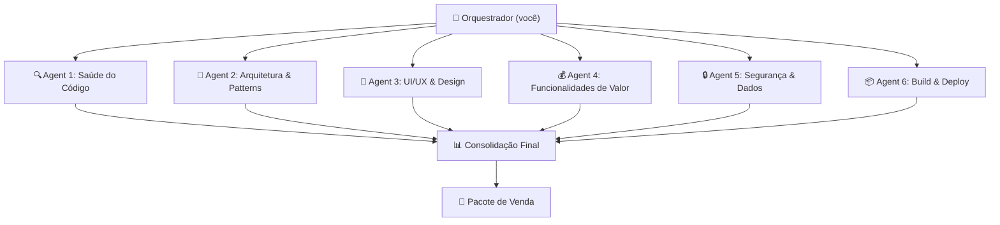

# Vida Flor — Estratégia de Varredura com Subagents (Claude Code CLI)

> **Meta:** Deixar o projeto pronto para venda em **2–3 dias**.
> **Método:** Varredura paralela com `claude --print` / `claude -p` usando subagents especializados, cada um focado em uma dimensão do projeto.

---

## Visão Geral da Abordagem

O projeto tem **14 feature modules** e ~218 arquivos em `src/`. Uma varredura manual seria lenta demais. A ideia é usar o **Claude Code CLI** para rodar **6 subagents paralelos**, cada um com um prompt especializado e saída estruturada em Markdown, que depois são consolidados num **relatório final de prontidão para venda**.



---

## Pré-requisitos

```bash
# Confirmar que claude CLI está instalado
claude --version

# Confirmar que o projeto compila
cd "c:\dev\Projetos\Vida Flor"
npx tsc --noEmit
npm run build
```

---

## Agent 1 — Saúde do Código (`code-health`)

**Objetivo:** Identificar erros de TypeScript, código morto, imports quebrados, duplicação, e inconsistências.

```bash
claude -p "
Você é um auditor de qualidade de código. Analise o projeto em c:\dev\Projetos\Vida Flor.

TAREFAS:
1. Rode 'npx tsc --noEmit' e liste TODOS os erros TypeScript
2. Identifique arquivos mortos (importados por ninguém):
   - Verifique cada arquivo em src/ se é importado por algum outro
   - Especial atenção: App.legacy.jsx, main.jsx vs main.tsx, dist2/3/4/5
3. Identifique imports quebrados ou circulares
4. Encontre código duplicado entre features (funções similares em diferentes stores)
5. Verifique se todas as convenções do CLAUDE.md estão sendo seguidas:
   - Valores monetários em centavos (não float)
   - Importações absolutas com @/ (não ../../../)
   - Storage keys via STORAGE_KEYS (não strings literais)
   - persistVidaFlor() (não persist() direto)
6. Verifique se há console.log/console.error esquecidos em produção

SAÍDA: Markdown estruturado com seções:
- ## Erros TypeScript (lista com arquivo:linha)
- ## Arquivos Mortos (lista com recomendação: deletar/manter)
- ## Imports Problemáticos
- ## Código Duplicado  
- ## Violações de Convenção
- ## Console.logs em Produção
- ## Score Geral (0-10) com justificativa

Cada item deve ter: severidade (🔴 crítico / 🟡 médio / 🟢 baixo), arquivo, e fix sugerido em 1 linha.
" > artefacts/scan-01-code-health.md
```

---

## Agent 2 — Arquitetura & Patterns (`architecture`)

**Objetivo:** Avaliar se a arquitetura está consistente, modular, e apresentável para um comprador.

```bash
claude -p "
Você é um arquiteto de software React. Analise a arquitetura do projeto Vida Flor em c:\dev\Projetos\Vida Flor.

Leia o CLAUDE.md para entender as convenções do projeto.

TAREFAS:
1. Verifique se cada feature em src/features/ segue o padrão documentado:
   types.ts, store.ts, migrations.ts, utils.ts, selectors.ts, seed.ts, api/, Screen.tsx
   Liste features INCOMPLETAS (faltam arquivos do padrão).
   
2. Verifique a consistência das migrations:
   - Cada feature tem FEATURE_VERSION?
   - A função migrate cobre todas as versões intermediárias?
   - Há riscos de perda de dados na migração?

3. Mapeie os acoplamentos entre features:
   - Quais features importam de outras features?  
   - Há acoplamentos circulares?
   - O único acoplamento permitido é organiza → financas. Há outros?

4. Avalie a store pattern:
   - Todas usam persistVidaFlor()?
   - Há stores sem selectors (lógica computada nos componentes)?
   - Actions fazem mutação direta ou usam set() corretamente?

5. Avalie a shared/ layer:
   - Componentes UI em shared/ui/ são genéricos e reutilizáveis?
   - Há componentes em shared/ que deveriam estar em features/?

6. Identifique 'code smells' arquiteturais:
   - Arquivos > 300 linhas
   - Componentes com > 5 responsabilidades
   - God stores com > 15 actions

SAÍDA: Markdown com:
- ## Mapa de Features (tabela: feature | arquivos presentes | status)
- ## Migrations (riscos e gaps)
- ## Acoplamentos (grafo simplificado)
- ## Code Smells
- ## Score Arquitetural (0-10)
- ## Top 5 Fixes Prioritários para venda
" > artefacts/scan-02-architecture.md
```

---

## Agent 3 — UI/UX & Design (`design`)

**Objetivo:** Avaliar a qualidade visual, consistência de design, e polimento da interface.

```bash
claude -p "
Você é um especialista em UI/UX para apps mobile-first React. Analise o Vida Flor em c:\dev\Projetos\Vida Flor.

Leia o skill de design em .claude/vidaflor-design/SKILL.md para entender a identidade visual.

TAREFAS:
1. Verifique se os tokens CSS estão sendo usados corretamente:
   - Procure por cores hardcoded (#fff, #000, #E8799A, etc.) em .tsx e .css
   - Procure por fonts hardcoded (Inter, Playfair, Lora) fora de tokens.css
   - Procure por valores mágicos de spacing/sizing (não usando tokens)

2. Verifique os conflitos listados no SKILL.md:
   - Conflict #1: body font override (Inter vs Geist)
   - Conflict #2: theme applier duplo  
   - Conflict #3 e #4
   - Quais foram resolvidos? Quais ainda existem?

3. Verifique a responsividade:
   - Componentes usam unidades relativas ou px fixo?
   - Há media queries ou é mobile-only?
   - Safe areas para PWA (notch, bottom bar)?

4. Verifique acessibilidade básica:
   - Botões têm aria-label?
   - Contraste de cores adequado?
   - Sem interações só por hover (mobile-first)?

5. Avalie a consistência visual entre screens:
   - Todas usam os mesmos componentes de UI (Btn, Card, Sheet)?
   - Há screens que parecem 'de outro app'?

6. Verifique a FlowerMark/Bloom (diferencial visual):
   - O componente funciona?
   - A animação é suave?
   - Reflete a vitalidade corretamente?

SAÍDA: Markdown com:
- ## Tokens & Cores (violações)
- ## Conflitos de Design (status)
- ## Responsividade
- ## Acessibilidade  
- ## Consistência Visual
- ## Bloom/FlowerMark
- ## Score Visual (0-10)
- ## Top 5 Polimentos para Impressionar Comprador
" > artefacts/scan-03-design.md
```

---

## Agent 4 — Funcionalidades de Valor (`features`)

**Objetivo:** Mapear o que funciona, o que está quebrado, e o que é "vendável".

```bash
claude -p "
Você é um product manager técnico. Analise as funcionalidades do Vida Flor em c:\dev\Projetos\Vida Flor.

TAREFAS:
1. Para CADA feature em src/features/, documente:
   - Nome e propósito
   - Status: ✅ Funcional | ⚠️ Parcial | ❌ Quebrado | 🔌 Não plugado
   - Funcionalidades implementadas (baseado em actions da store)
   - Funcionalidades prometidas mas não implementadas
   - Bugs conhecidos (baseado em código defensivo, TODO/FIXME, try/catch genéricos)

2. Mapeie as features NÃO PLUGADAS na navegação:
   - casa, kids, pets estão construídas mas não acessíveis? Verificar routes.ts
   - agenda está plugada?
   - auth está plugada?

3. Avalie a feature 'financas' em detalhe (maior valor para venda):
   - Transações funcionam? (add, edit, delete)
   - Envelopes/categorias existem?
   - Gráficos com Recharts funcionam?
   - Lista de compras com integração financeira funciona?

4. Avalie a feature 'bloom' (diferencial do produto):
   - A vitalidade é calculada corretamente?
   - Quais features alimentam a vitalidade?
   - A flor renderiza e anima?

5. Identifique features que um comprador valorizaria mais:
   - Ranking por complexidade de implementação vs valor percebido
   - O que está 80% pronto e precisa de um push final

6. Identifique TODO/FIXME/HACK no código

SAÍDA: Markdown com:
- ## Inventário de Features (tabela completa)
- ## Features Não Plugadas (potencial oculto)
- ## Deep Dive: Finanças
- ## Deep Dive: Bloom
- ## Value Map (o que vende mais)
- ## TODOs e Débitos
- ## Score Funcional (0-10)
" > artefacts/scan-04-features.md
```

---

## Agent 5 — Segurança & Dados (`security`)

**Objetivo:** Garantir que não há problemas de segurança, privacidade, ou perda de dados.

```bash
claude -p "
Você é um especialista em segurança de aplicações web. Analise o Vida Flor em c:\dev\Projetos\Vida Flor.

CONTEXTO: É um SPA sem backend. Todo dado persiste em localStorage/window.storage. Tem um sistema de PIN para login (src/features/auth/).

TAREFAS:
1. Analise o sistema de auth (src/features/auth/):
   - O PIN é armazenado de forma segura? (hash ou plaintext?)
   - Há proteção contra brute-force?
   - O PIN pode ser bypassado pelo console do browser?

2. Analise a persistência de dados:
   - Dados financeiros estão em localStorage sem criptografia?
   - Há risco de perda de dados por limpar cache?
   - O adapter.ts tem fallback robusto?
   - O debounce de 300ms pode causar perda de dados se fechar o app?

3. Analise dependências (package.json):
   - Versões com vulnerabilidades conhecidas?
   - jsdom está em dependencies (não devDependencies) - é necessário em prod?

4. Busque por padrões perigosos:
   - eval(), innerHTML, dangerouslySetInnerHTML
   - Dados sensíveis em console.log
   - Tokens/chaves expostos no código fonte

5. Analise o ruvector.db na raiz:
   - O que é esse arquivo? Deve estar no .gitignore?
   - Contém dados sensíveis?

6. Analise as múltiplas pastas dist (dist, dist2, dist3, dist4, dist5, dist-build):
   - Estão no .gitignore?
   - Contêm dados ou credentials?

SAÍDA: Markdown com:
- ## Auth & PIN
- ## Persistência & Dados
- ## Dependências
- ## Padrões Perigosos
- ## Arquivos Sensíveis
- ## Score de Segurança (0-10)
- ## Ações Imediatas (antes de mostrar para comprador)
" > artefacts/scan-05-security.md
```

---

## Agent 6 — Build, Deploy & Packaging (`build`)

**Objetivo:** Garantir que o projeto builda, roda, e está apresentável para demonstração.

```bash
claude -p "
Você é um DevOps/Build engineer. Analise o pipeline de build do Vida Flor em c:\dev\Projetos\Vida Flor.

TAREFAS:
1. Verifique o build de produção:
   - 'npm run build' completa sem erros?
   - Qual o tamanho do bundle? (analisar dist/)
   - Há code splitting ou é um bundle monolítico?
   - Tree shaking está funcionando?

2. Verifique o Vite config:
   - vite.config.ts está otimizado?
   - Aliases estão corretos?
   - Há plugins desnecessários?

3. Verifique o tsconfig.json:
   - Strict mode?
   - Target correto?
   - Paths aliases batem com vite.config?

4. Analise o deploy:
   - .github/workflows/ — tem CI/CD?
   - GitHub Pages está configurado?
   - PWA manifest e service worker existem?
   - index.html está correto (favicon, meta tags, OG tags)?

5. Verifique a 'limpeza' do repo para venda:
   - settings.json na raiz — deve ser movido para .vscode/?
   - ruvector.db — deve ser removido/gitignored?
   - Múltiplas pastas dist — só uma deveria existir
   - App.legacy.jsx — arquivo de 142KB deveria ser removido
   - artefacts/ — são necessários para o comprador?

6. Crie um checklist de 'cleanup antes de listar para venda'

SAÍDA: Markdown com:
- ## Build Status
- ## Bundle Analysis
- ## Config Review
- ## Deploy/CI
- ## Limpeza do Repo (tabela: item | ação | prioridade)
- ## Score de Prontidão (0-10)
- ## Checklist Pré-Venda
" > artefacts/scan-06-build.md
```

---

## Cronograma de Execução (2–3 Dias)

### Dia 1 — Varredura & Diagnóstico (4-6h)

| Hora | Ação |
|------|------|
| 0:00 | Rodar Agents 1-6 em paralelo (pode rodar 2-3 por vez) |
| 1:00 | Coletar outputs dos 6 agents |
| 1:30 | Consolidar num relatório único de prontidão |
| 2:00 | Priorizar: fixes **🔴 críticos** primeiro |
| 2:30 | Começar fixes automáticos via Claude Code |
| 6:00 | Fim do Dia 1 — críticos resolvidos |

### Dia 2 — Estabilização & Polish (4-6h)

| Hora | Ação |
|------|------|
| 0:00 | Fixes **🟡 médios**: código morto, consistência visual, features não plugadas |
| 2:00 | Plugar features ocultas (casa, kids, pets) na navegação |
| 3:00 | Polimento visual (resolver conflitos de design) |
| 4:00 | Cleanup do repo (remover dist2-5, App.legacy, ruvector.db) |
| 5:00 | Rebuild + smoke test completo |
| 6:00 | Fim do Dia 2 — app estável e polido |

### Dia 3 — Pacote de Venda (2-4h)

| Hora | Ação |
|------|------|
| 0:00 | Gerar README.md profissional voltado para comprador |
| 1:00 | Screenshots/GIF de demonstração |
| 2:00 | Documentar: stack, features, roadmap, monetização possível |
| 3:00 | Deploy final no GitHub Pages para demo ao vivo |
| 4:00 | **Pronto para listar** |

---

## Agent de Consolidação Final

Após os 6 scans, rode este agent consolidador:

```bash
claude -p "
Leia os 6 relatórios de scan em artefacts/scan-01 até scan-06.
Gere um RELATÓRIO EXECUTIVO DE PRONTIDÃO PARA VENDA contendo:

1. ## Score Geral (média ponderada dos 6 scores)
2. ## Resumo Executivo (3 parágrafos: o que é, o que funciona, o que precisa de atenção)
3. ## Pontos Fortes para Venda (top 5)
4. ## Riscos/Gaps (top 5 por impacto)
5. ## Ações Obrigatórias pré-venda (itens 🔴)
6. ## Ações Recomendadas (itens 🟡)
7. ## Valor Estimado (baseado em: horas de trabalho, complexidade, stack moderna, features)
8. ## Pitch de 1 Parágrafo (para listagem em marketplace)

Seja brutalmente honesto nos gaps, mas destaque o valor real do que foi construído.
" > artefacts/scan-00-relatorio-final.md
```

---

## Como Executar

### Opção A — Sequencial (mais seguro)
```bash
# Rodar um por um, revisando cada output
claude -p "<prompt agent 1>" > artefacts/scan-01-code-health.md
# revisar...
claude -p "<prompt agent 2>" > artefacts/scan-02-architecture.md
# revisar...
# ... e assim por diante
```

### Opção B — Paralelo (mais rápido)
```powershell
# PowerShell — rodar 3 agents em paralelo
Start-Job { claude -p "..." > artefacts/scan-01-code-health.md }
Start-Job { claude -p "..." > artefacts/scan-02-architecture.md }
Start-Job { claude -p "..." > artefacts/scan-03-design.md }
Wait-Job *
# Depois os outros 3...
```

### Opção C — Script Orquestrador
Crie um script `scan.ps1` que roda todos os agents e consolida.

---

## Notas Importantes

> [!CAUTION]
> Os agents de scan são **read-only**. Eles **NÃO devem modificar código**. O objetivo é diagnóstico. Correções vêm depois, priorizadas pelo relatório.

> [!IMPORTANT]
> O projeto usa `window.storage` (Claude Artifacts API) com fallback para `localStorage`. Um comprador precisa saber que é **offline-only, sem backend**. Isso pode ser feature (privacidade) ou limitação, dependendo do posicionamento.

> [!TIP]
> O diferencial deste app é a **metáfora botânica** (flor que cresce com o cuidado do usuário) + **gestão familiar completa** (finanças, saúde, rotina, kids, pets, casa, espiritualidade). Isso deve ser destaque no pitch de venda.
